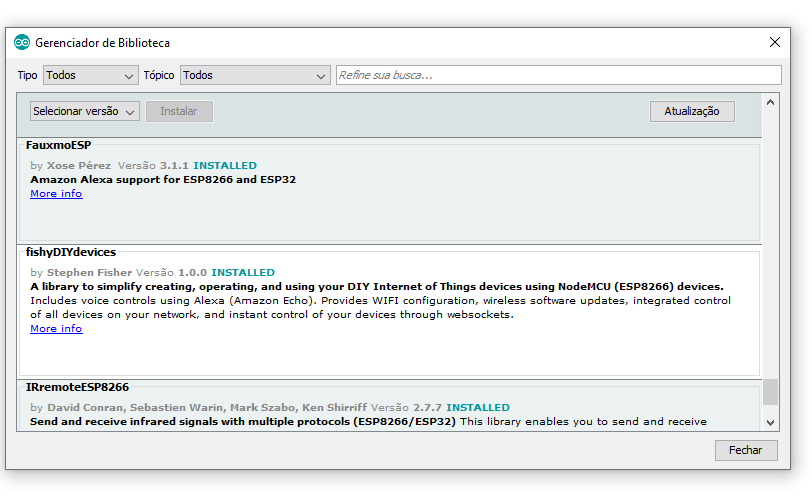
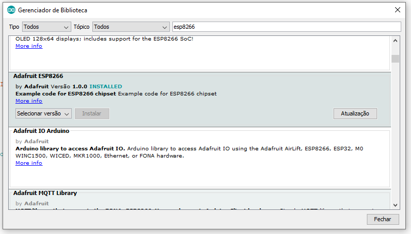

# Communication Between NodeMCU & Alexa

## Requisites:

- fauxmoESP 3.1.1 (tested in Amazon Echo g3)

- ESP8266WiFi

## Install Libraries

#### First you need to install the Fauxmo library, click in: Tools -> Library Manager (or ctrl+shift+I), search for "fauxmoesp" and check for install it.

#### After Fauxmo, you need to install ESP8266 lib, i use the Adafruit version, It's the same step, search for "esp8266" in search field.
